# Bellabeat Activity Data Analysis
### author: "Xinxin Wu & Chaoran Chen"

## Overview

In this case study, we acted as junior data analysts at Bellabeat, a high-tech manufacturer of health-focused products for women. Throughout this study, we analyzed smart device data to gain insights into how consumers are using non-Bellabeat smart devices. These insights will be applied to one Bellabeat product to guide the marketing strategy for the company.

We used a public dataset from Kaggle ([FitBit Fitness Tracker Data](https://www.kaggle.com/datasets/arashnic/fitbit)) containing smart device usage data, and our task is to extract meaningful information from it to answer the following questions.


## Ask
1. What are some **trends** in smart device usage? We investigated **trends** in three levels (i.e., daily, hourly, and minute levels). For each level, we specified our research questions and hypothesis:
    0. Data distribution
        1. Different number of people in the datasets
        2. Obesity distribution based on *BMI*
        3. Daily step distribution 
        4. Sleep time distribution
    1. Daily
        1. What is the relation among *step*, *distance*, and *calories*? -> **Do people with more steps burn more calories?** 
            - Hypothesis: There exists positive relation among *step*, *distance*, and *calories*.
        2. What is the relation between *step* and *SedentaryMinutes*? -> **Do people with more steps sit less?**
            - Hypothesis: There exists negative relation between *step* and *SedentaryMinutes*.
        3. What is the relation between *step* and *sleep time*? -> **Do people with more steps sleep longer?**
            - Hypothesis: There exists positive relation between *step* and *sleep time*.
        4. What is the relation between *SedentaryMinutes* and *sleep time*? -> **Do people sit longer sleep longer?**
        5. Which intensity of activity is the major one in the aspect of time? -> **Which intensity of activity does people prefer?**
        6. What is the difference between *weekday* and *weekend* for *step*? -> **Do people have prefer walking during weekends or weekdays?**
    2. Hourly
        1. What is the hourly step distribution? -> **When do people usually walk?**
        2. What is the relation between *step* and *calories* of every hour in an average day? 
        3. Do people have different step count patterns on *weekdays* and *weekends*?
    3. Minute
        1. Verify our guess: *some sedentary time detected by the smart devices actually belonged to sleep time.*
        
2. How could these trends apply to Bellabeat customers? How could these trends help influence Bellabeat marketing strategy? -> **Customer trend & marketing strategy**

## Prepare

### Loading Packages


```r
library(lubridate) # for converting data into datetime format
```

```
## 
## Attaching package: 'lubridate'
```

```
## The following objects are masked from 'package:base':
## 
##     date, intersect, setdiff, union
```

```r
library(tidyverse)
```

```
## ── Attaching core tidyverse packages ──────────────────────── tidyverse 2.0.0 ──
## ✔ dplyr   1.1.2     ✔ readr   2.1.4
## ✔ forcats 1.0.0     ✔ stringr 1.5.0
## ✔ ggplot2 3.4.2     ✔ tibble  3.2.1
## ✔ purrr   1.0.1     ✔ tidyr   1.3.0
```

```
## ── Conflicts ────────────────────────────────────────── tidyverse_conflicts() ──
## ✖ dplyr::filter() masks stats::filter()
## ✖ dplyr::lag()    masks stats::lag()
## ℹ Use the conflicted package (<http://conflicted.r-lib.org/>) to force all conflicts to become errors
```

```r
library(dplyr)
library(ggplot2) # for data viz
library(tidyr)
library(readr) # for importing data
```

### Importing Datasets

```r
# daily
dailyActivity <- read.csv("../Data/source_data/dailyActivity_merged.csv")
dailyWeight <- read.csv("../Data/source_data/weightLogInfo_merged.csv")
dailySleep <- read.csv("../Data/source_data/sleepDay_merged.csv")

# hourly
hourlyActivity <- read.csv("../Data/source_data/hourlySteps_merged.csv")
hourlyIntensity <- read.csv("../Data/source_data/hourlyIntensities_merged.csv")
hourlyCalories <- read.csv("../Data/source_data/hourlyCalories_merged.csv")

# minute
minuteIntensity <- read.csv("../Data/source_data/minuteIntensitiesNarrow_merged.csv")
minuteSleep <- read.csv("../Data/source_data/minuteSleep_merged.csv")
```


## Process
We first used head() to skim our data.

```r
# head(dailyActivity)
# head(dailyWeight)
# head(dailySleep)
```

We found the data type of *ActivityDate*, *Date*, and *SleepDay* had some error. They were in *chr* type, but we needed to convert them into *datetime* format.


```r
# Convert the 'ActivityDate' column from character to datetime format
dailyActivity$ActivityDate <- as.Date(dailyActivity$ActivityDate, format = "%m/%d/%Y")

# We focus on the daily level, so we drop the information of the exact time.
dailyWeight$Date <- as.Date(dailyWeight$Date, format = "%m/%d/%Y")
dailySleep$SleepDay <- as.Date(dailySleep$SleepDay, format = "%m/%d/%Y")

# head(dailyActivity)
# head(dailyWeight)
# head(dailySleep)
```


```r
# We split the ActivityHour into Date and Time, and convert the time into 24-hour format.
hourlyActivity <- hourlyActivity %>%
  mutate(Date = as.Date(ActivityHour, format = "%m/%d/%Y"),
         Time = format(as.POSIXct(ActivityHour, format = "%m/%d/%Y %I:%M:%S %p"), format = "%H:%M:%S"))

hourlyCalories <- hourlyCalories %>%
  mutate(Date = as.Date(ActivityHour, format = "%m/%d/%Y"),
         Time = format(as.POSIXct(ActivityHour, format = "%m/%d/%Y %I:%M:%S %p"), format = "%H:%M:%S"))

hourlyIntensity <- hourlyIntensity %>%
  mutate(Date = as.Date(ActivityHour, format = "%m/%d/%Y"),
         Time = format(as.POSIXct(ActivityHour, format = "%m/%d/%Y %I:%M:%S %p"), format = "%H:%M:%S"))
```


```r
print(paste("number of people in hourlyActivity:", n_distinct(hourlyActivity$Id)))
```

```
## [1] "number of people in hourlyActivity: 33"
```

```r
print(paste("number of people in hourlyCalories:", n_distinct(hourlyCalories$Id)))
```

```
## [1] "number of people in hourlyCalories: 33"
```

```r
print(paste("number of people in hourlyIntensity:", n_distinct(hourlyIntensity$Id)))
```

```
## [1] "number of people in hourlyIntensity: 33"
```


```r
hourlyData <- hourlyActivity %>%
  full_join(hourlyCalories, by = c("Id", "ActivityHour", "Date", "Time"))

hourlyData <- hourlyData %>%
  full_join(hourlyIntensity, by = c("Id", "ActivityHour", "Date", "Time"))
```


## Analyse & Share

#### 0. Data distribution

##### 1. Difference in people number


```r
print(paste("number of people in dailyWeight:", n_distinct(dailyWeight$Id)))
```

```
## [1] "number of people in dailyWeight: 8"
```

```r
print(paste("number of people in dailyActivity:", n_distinct(dailyActivity$Id)))
```

```
## [1] "number of people in dailyActivity: 33"
```

```r
print(paste("number of people in dailySleep:", n_distinct(dailySleep$Id)))
```

```
## [1] "number of people in dailySleep: 24"
```

The numbers of people in the three datasets are unequal. 


##### 2. Obesity distribution based on *BMI*


```r
BMI <- dailyWeight %>% 
  group_by(Id) %>% 
  summarise(mean_BMI = mean(BMI), mean_weight = mean(WeightKg)) %>% 
  arrange(mean_BMI)

print(BMI) # Healthy Weight: 18.5 – 24.9, Overweight: 25.0 – 29.9, Obesity: >30.0
```

```
## # A tibble: 8 × 3
##           Id mean_BMI mean_weight
##        <dbl>    <dbl>       <dbl>
## 1 2873212765     21.6        57  
## 2 1503960366     22.6        52.6
## 3 6962181067     24.0        61.6
## 4 8877689391     25.5        85.1
## 5 4558609924     27.2        69.6
## 6 4319703577     27.4        72.4
## 7 5577150313     28          90.7
## 8 1927972279     47.5       134.
```

There are 8 people providing their weight data. We found that 3 people had healthy weight, 4 people were overweight, and 1 was obesity. 


##### 3. Step distribution


```r
ggplot(dailyActivity, aes(x = TotalSteps)) +
  geom_histogram(aes(y=..density..), binwidth=2000, colour="black", fill="white") +
  geom_density(alpha=.2, fill="#FF6666") + 
  geom_vline(aes(xintercept=mean(TotalSteps)), color="red", linetype="dashed", linewidth=1) + 
  labs(title = paste("Step distribution. The average step is ", mean(dailyActivity$TotalSteps)), x = "Total Steps")
```

```
## Warning: The dot-dot notation (`..density..`) was deprecated in ggplot2 3.4.0.
## ℹ Please use `after_stat(density)` instead.
## This warning is displayed once every 8 hours.
## Call `lifecycle::last_lifecycle_warnings()` to see where this warning was
## generated.
```

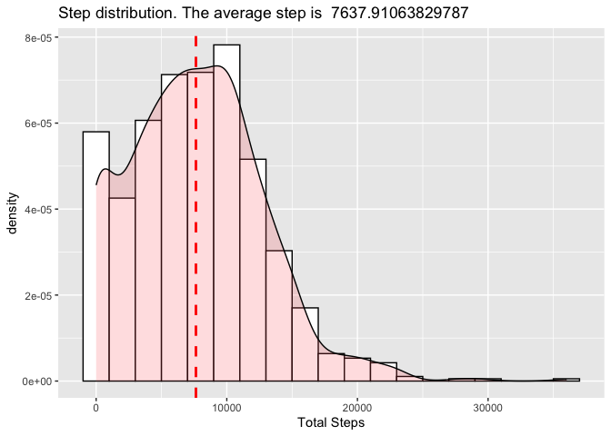<!-- -->

The average steps are close to 8000 steps, which is the daily step recommendation number from CDC.


##### 4. Sleep quality 


```r
sleep_quality <- dailySleep %>% 
  group_by(Id) %>% 
  summarise(mean_asleep = mean(TotalMinutesAsleep)/60, mean_inBed = mean(TotalTimeInBed)/60) %>% 
  arrange(mean_asleep)

ggplot(sleep_quality, aes(x = mean_asleep)) +
  geom_histogram(binwidth=1, colour="black", fill="white") +
  geom_vline(aes(xintercept=mean(dailySleep$TotalMinutesAsleep)/60), color="red", linetype="dashed", linewidth=1) + 
  labs(title = paste("Sleep time distribution. The average sleep time is ", round(mean(dailySleep$TotalMinutesAsleep)/60), " hr"), x = "Sleep time")
```

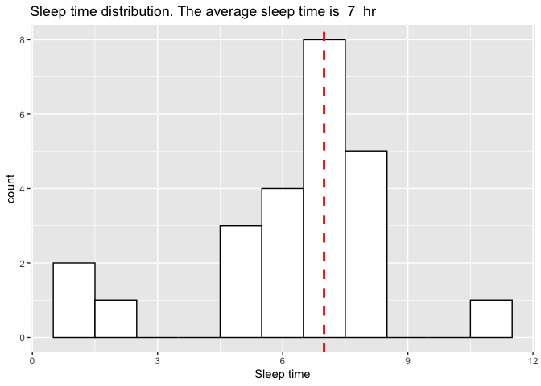<!-- -->

The average sleep time is 7 hours. There are 3 people that have less than 3 hours average sleep time, which seems weird.

### Daily

#### 1. What is the relation among *step*, *distance*, and *calories*? 


```r
correlation_steps_distance <- cor(dailyActivity$TotalSteps, dailyActivity$TotalDistance)
ggplot(dailyActivity, aes(x = TotalSteps, y = TotalDistance)) +
  geom_point() +
  geom_smooth(method = "loess", se = TRUE, color = "blue") +
  labs(title = paste("Correlation_steps_distance:", round(correlation_steps_distance, 2)), x = "Total Steps", y = "Total Distance")
```

```
## `geom_smooth()` using formula = 'y ~ x'
```

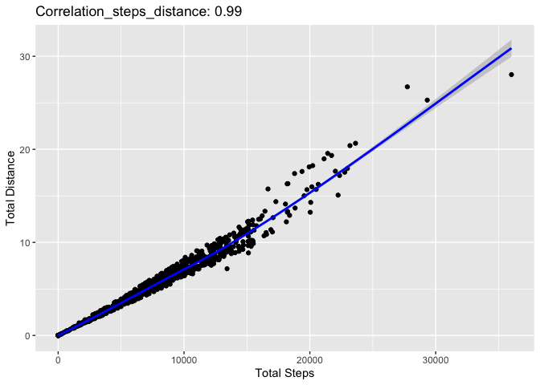<!-- -->


```r
correlation_steps_calories <- cor(dailyActivity$TotalSteps, dailyActivity$Calories)
ggplot(dailyActivity, aes(x = TotalSteps, y = Calories)) +
  geom_point() +
  geom_smooth(method = "loess", se = TRUE, color = "blue") + 
  labs(title = paste("Correlation_steps_calories:", round(correlation_steps_calories, 2)), x = "Total Steps", y = "Calories")
```

```
## `geom_smooth()` using formula = 'y ~ x'
```

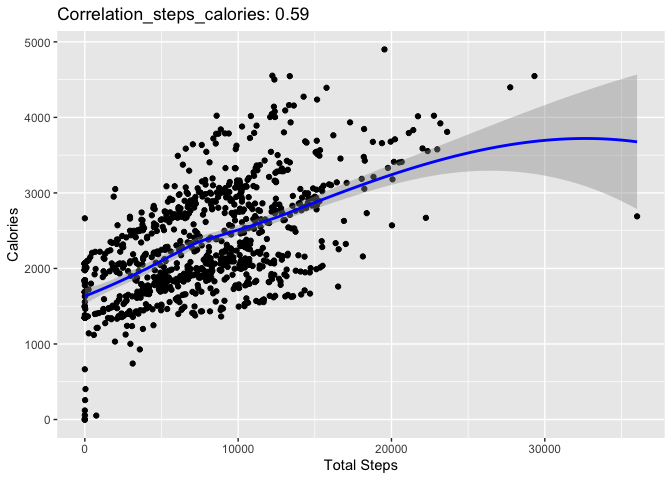<!-- -->

We found that *total steps* are strongly positive with *total distance*. There is positive relation between *total steps* and *calories*. 


#### 2. What is the relation between *step* and *SedentaryMinutes*? 


```r
correlation_steps_sedentary_time <- cor(dailyActivity$TotalSteps, dailyActivity$SedentaryMinutes)
ggplot(dailyActivity, aes(x = TotalSteps, y = SedentaryMinutes)) +
  geom_point() +
  geom_smooth(method = "loess", se = TRUE, color = "blue") +
  labs(title = paste("Correlation_steps_sedentary_time:", round(correlation_steps_sedentary_time, 2)), x = "Total Steps", y = "Sedentary Minutes")
```

```
## `geom_smooth()` using formula = 'y ~ x'
```

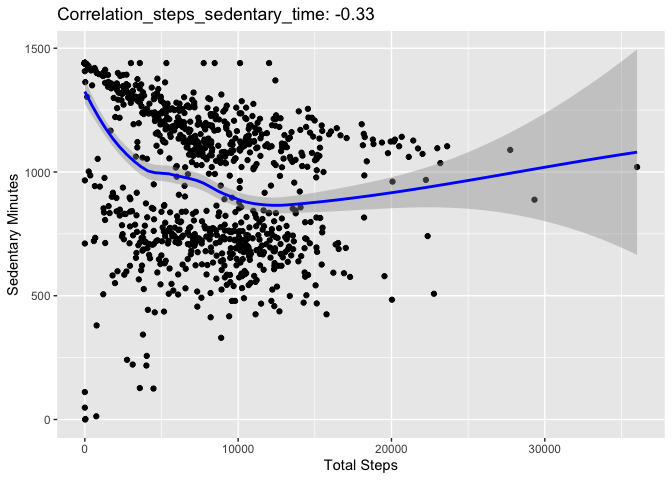<!-- -->

There is weakly negative relation between step and sedentary minutes.

#### 3. What is the relation between *step* and *sleep time*? -> **Do people with more steps sleep longer?**


```r
# inner join the dailyActivity and dailySleep by Id
step_sleep <- merge(dailyActivity, dailySleep, by.x = c("Id", "ActivityDate"), by.y = c("Id", "SleepDay"))

correlation_steps_sleep_time <- cor(step_sleep$TotalSteps, step_sleep$TotalMinutesAsleep)

ggplot(step_sleep, aes(x = TotalSteps, y = TotalMinutesAsleep)) +
  geom_point() +
  geom_smooth(method = "loess", se = TRUE, color = "blue") +
  labs(title = paste("Correlation_steps_sleep_time:", round(correlation_steps_sleep_time , 2)), x = "Total Steps", y = "Sleep Time(minutes)")
```

```
## `geom_smooth()` using formula = 'y ~ x'
```

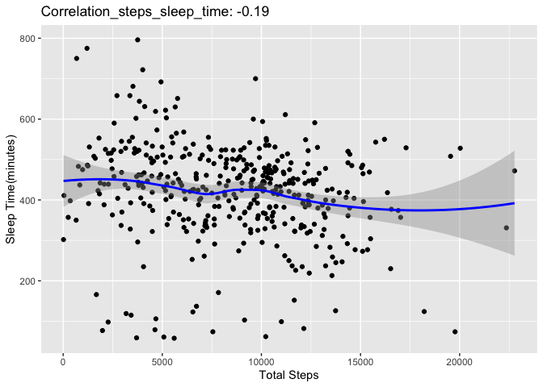<!-- -->

There is no obvious relation between steps and sleep time.

#### 4. What is the relation between *SedentaryMinutes* and *sleep time*? -> **Do people sit longer sleep longer?**


```r
# We found there were two data points that only have 0 and 2 minutes of sedentary time. We removed these two outliers.
step_sleep <- step_sleep %>% filter(SedentaryMinutes > 2) %>%  arrange(TotalMinutesAsleep)
```


```r
correlation_sedentary_sleep_time <- cor(step_sleep$SedentaryMinutes, step_sleep$TotalMinutesAsleep)

ggplot(step_sleep, aes(x = SedentaryMinutes, y = TotalMinutesAsleep)) +
  geom_point() +
  geom_smooth(method = "loess", se = TRUE, color = "blue") +
  labs(title = paste("Correlation_sedentary_sleep_time:", round(correlation_sedentary_sleep_time , 2)), x = "Total Sedentary Time", y = "Sleep Time(minutes)") +
  geom_rect(xmin = 920, xmax = 1280, ymin = 0, ymax = 200, fill = NA, color = "red")
```

```
## `geom_smooth()` using formula = 'y ~ x'
```

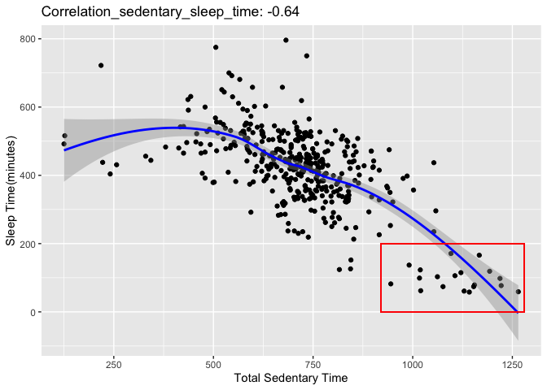<!-- -->

There is a negative relation between sedentary time and sleep time. **But we found that there are some people who sleep less than 3.5 hours but sit for over 16 hours (red rectangle area in the figure). We guessed whether some sedentary time detected by the smart devices actually belonged to sleep time.**


#### 5. Which intensity of activity is the major one in the aspect of time? -> **Which intensity of activity does people prefer?**


```r
# Convert data from wide format to long format
intensity_time <- dailyActivity %>% 
  select(LightlyActiveMinutes, FairlyActiveMinutes, VeryActiveMinutes)

mean_intensity_time <- intensity_time %>% summarise(mean_LightlyActiveMinutes = mean(LightlyActiveMinutes),
                             mean_FairlyActiveMinutes = mean(FairlyActiveMinutes),
                             mean_VeryActiveMinutes = mean(VeryActiveMinutes))

print(mean_intensity_time)
```

```
##   mean_LightlyActiveMinutes mean_FairlyActiveMinutes mean_VeryActiveMinutes
## 1                  192.8128                 13.56489               21.16489
```

```r
intensity_time <- intensity_time %>%
  pivot_longer(
    cols = c(LightlyActiveMinutes, FairlyActiveMinutes, VeryActiveMinutes),
    names_to = "type",
    values_to = "time"
)

# Rename the "type" column to match the specified values
intensity_time$type <- ifelse(intensity_time$type == "LightlyActiveMinutes", "1_LightlyActive",
                         ifelse(intensity_time$type == "FairlyActiveMinutes", "2_FairlyActive", "3_VeryActive"))

intensity_time %>%
  ggplot(aes(x=time)) +
    geom_histogram(mapping = aes(color=type),  fill="white", binwidth=30, alpha=0.4, position = 'identity') +
    labs(title="Distribution of Activity Intensity (minutes)") + 
    facet_wrap(~type)
```

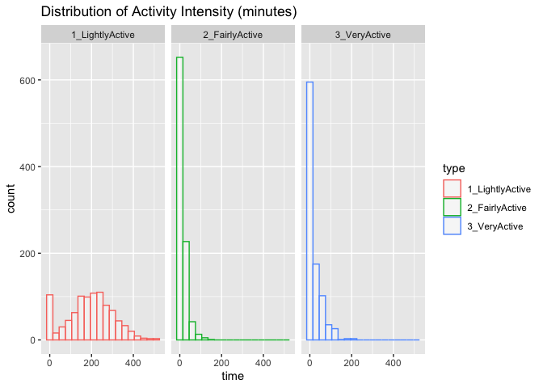<!-- -->

**Most people prefer doing light activity**. The distribution of LightlyActive looks like subjects to normal distribution.


#### 6. What is the difference between *weekday* and *weekend* for *step*? -> **Do people have prefer walking during weekends or weekdays?**


```r
# add a new column to identify if the date belongs to weekdays
dailyActivity_weekday <- dailyActivity %>% 
  select(ActivityDate, TotalSteps) %>% 
  mutate(Weekday = ifelse(weekdays(ActivityDate) %in% c("Saturday", "Sunday"), "Weekend", "Weekday"))

dailyActivity_weekday_median <- dailyActivity_weekday %>% 
  group_by(Weekday) %>% 
  summarise(median = median(TotalSteps))

print(dailyActivity_weekday_median)
```

```
## # A tibble: 2 × 2
##   Weekday median
##   <chr>    <int>
## 1 Weekday   7802
## 2 Weekend   6708
```

```r
ggplot(dailyActivity_weekday, aes(x=TotalSteps)) + 
    geom_histogram(mapping = aes(color=Weekday, y=..density..),  fill="white", binwidth=1000, alpha=0.6, position = 'identity') +
    geom_density(fill="#FF6666", alpha=.2) +
    labs(title="Step Distribution during Weekdays and Weekends") + 
    geom_vline(data = dailyActivity_weekday_median, mapping = aes(xintercept = median), color="blue",  linetype="dashed") +
    facet_wrap(~Weekday)
```

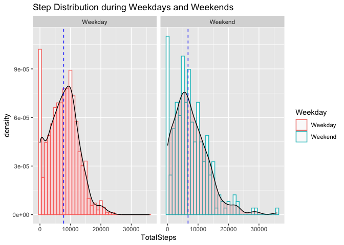<!-- -->
**People's step counts are more concentrated and have larger medians on weekdays.** On weekends, the distribution of steps is more spread out, and some people will walk more than usual (e.g., more than 25k steps).


### Hourly

#### 1. What is the hourly step distribution? -> **When do people usually walk?**


```r
hourlyMeanData <- hourlyData %>% 
  group_by(Time) %>% 
  summarise(mean_hourly_step = mean(StepTotal), 
            mean_hourly_intensity = mean(TotalIntensity),
            mean_hourly_calories = mean(Calories))

hourlyMeanDataLong <- hourlyMeanData %>%
  gather(key = "Metric", value = "Value", mean_hourly_step, mean_hourly_intensity, mean_hourly_calories)

ggplot(hourlyMeanDataLong, aes(x = Time, y = Value, group = 1)) +
  geom_line() +
  labs(x = "Time") +
  facet_wrap(~ Metric, ncol = 1, scales = "free_y", 
             labeller = as_labeller(c(mean_hourly_step = "Mean Hourly Step", 
                                      mean_hourly_intensity = "Mean Hourly Intensity", 
                                      mean_hourly_calories = "Mean Hourly Calories"))) +
  theme_minimal() +
  theme(axis.text.x = element_text(angle = 90, hjust = 1))
```

<!-- -->
The three line charts have similar trends, demonstrating that people prefer doing exercise at noon (12:00-14:00) or evening (17:00-19:00). 

#### 2. What is the relation between *step* and *calories* of every hour in an average day? 


```r
correlation_steps_intensity <- cor(hourlyData$StepTotal, hourlyData$TotalIntensity)
ggplot(hourlyData, aes(x = StepTotal, y = TotalIntensity)) +
  geom_jitter() +
  geom_smooth(method = "loess", se = TRUE, color = "blue") +
  labs(title = paste("Correlation_steps_intensity:", round(correlation_steps_intensity, 2)), x = "Total Steps", y = "Total Intensity") +
  geom_rect(xmin = 0, xmax = 2500, ymin = 100, ymax = 185, fill = NA, color = "red")
```

```
## `geom_smooth()` using formula = 'y ~ x'
```

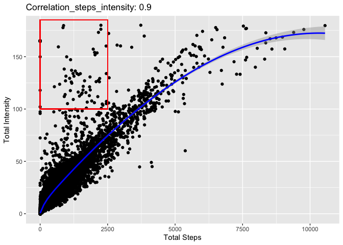<!-- -->

```r
correlation_steps_calories <- cor(hourlyData$StepTotal, hourlyData$Calories)
ggplot(hourlyData, aes(x = StepTotal, y = Calories)) +
  geom_jitter() +
  geom_smooth(method = "loess", se = TRUE, color = "blue") +
  labs(title = paste("Correlation_steps_calories:", round(correlation_steps_calories, 2)), x = "Total Steps", y = "Calories")+
  geom_rect(xmin = 0, xmax = 2500, ymin = 500, ymax = 750, fill = NA, color = "red")
```

```
## `geom_smooth()` using formula = 'y ~ x'
```

<!-- -->

```r
correlation_intensity_calories <- cor(hourlyData$TotalIntensity, hourlyData$Calories)
ggplot(hourlyData, aes(x = TotalIntensity, y = Calories)) +
  geom_jitter() +
  geom_smooth(method = "loess", se = TRUE, color = "blue") +
  labs(title = paste("Correlation_intensity_calories:", round(correlation_intensity_calories, 2)), x = "Total Intensity", y = "Calories")
```

```
## `geom_smooth()` using formula = 'y ~ x'
```

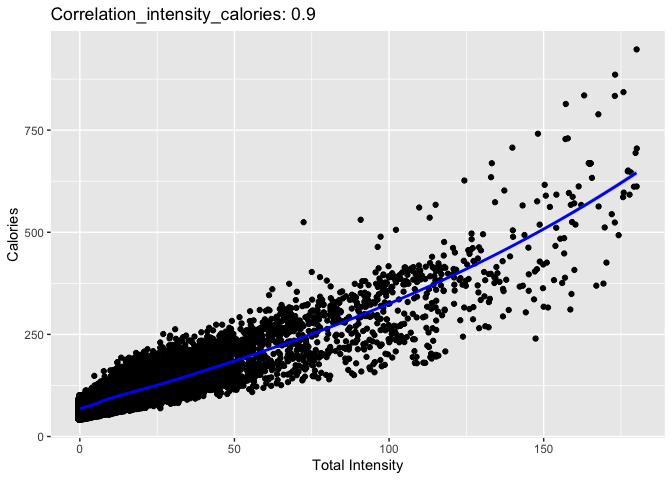<!-- -->

We found that **hourly steps, hourly intensity, and hourly calories all have strongly positive relation** with each other. But we also found an interesting phenomenon: **the calories and intensity could be very high even with a few steps** (The red rectangle area in the figures). This may imply that steps or walking only count to part of the calories consumption and intensity. People can do some exercises with few steps but have high calories consumption and intensity.


#### 3. Do people have different step count patterns on *weekdays* and *weekends*?


```r
hourlyData_weekday <- hourlyData %>% 
  mutate(Weekday = ifelse(weekdays(Date) %in% c("Saturday", "Sunday"), "Weekend", "Weekday"))

hourlyMeanData_weekday <- hourlyData_weekday %>% 
  filter(Weekday == "Weekday") %>% 
  group_by(Time) %>% 
  summarise(mean_hourly_step = mean(StepTotal))

hourlyMeanData_weekend <- hourlyData_weekday %>% 
  filter(Weekday == "Weekend") %>% 
  group_by(Time) %>% 
  summarise(mean_hourly_step = mean(StepTotal))

# Step 1: Combine the data frames and add a grouping variable to differentiate weekday and weekend
hourlyMeanData_combined <- bind_rows(
  mutate(hourlyMeanData_weekday, group = "Weekday"),
  mutate(hourlyMeanData_weekend, group = "Weekend")
)

# Step 2: Plot the combined data with different colors for each group
ggplot(hourlyMeanData_combined, aes(x = Time, y = mean_hourly_step, group = group, color = group)) +
  geom_line() +
  labs(x = "Time", y = "Mean Hourly Step") +
  ggtitle("Mean Hourly Steps") +
  theme_minimal() +
  theme(axis.text.x = element_text(angle = 90, hjust = 1))
```

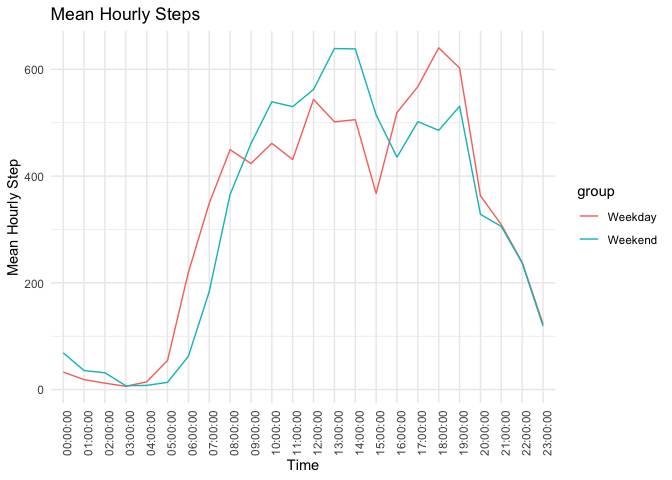<!-- -->

We found that **weekday and weekend have different peaks**. In weekdays, **people prefer doing exercise during 17:00-19:00, while on weekends, people prefer walking at noon (13:00-14:00).** Meanwhile, people *wake up later on weekends*, which is reflected in the line shift in the morning.

### Minute

#### Verify our guess: *some sedentary time detected by the smart devices actually belonged to sleep time.*


```r
draw_sit <- function(specificId, specificDate) {
  personSit <- minuteIntensity %>%
    mutate(Date = as.Date(ActivityMinute, format = "%m/%d/%Y"),
           Time = format(as.POSIXct(ActivityMinute, format = "%m/%d/%Y %I:%M:%S %p"), format = "%H:%M:%S")) %>%
    filter(Id == specificId	 & Date == as.Date(specificDate, format = "%m/%d/%Y")) %>%
    group_by(Hour = format(as.POSIXct(Time, format = "%H:%M:%S"), format = "%H")) %>%
    summarise(AverageValue = mean(Intensity, na.rm = TRUE))
  
  ggplot(data = personSit, aes(x = Hour, y = AverageValue)) +
    geom_point() +
    labs(title=specificDate) +
    xlab("Hour") +
    ylab("AverageValue")
}
```


```r
draw_sleep <- function(specificId, specificDate) {
  personSleep <- minuteSleep %>%
    mutate(Date = as.Date(date, format = "%m/%d/%Y"),
           Time = format(as.POSIXct(date, format = "%m/%d/%Y %I:%M:%S %p"), format = "%H:%M:%S")) %>%
    filter(Id == specificId & Date == as.Date(specificDate, format = "%m/%d/%Y")) %>%
    group_by(Hour = format(as.POSIXct(Time, format = "%H:%M:%S"), format = "%H")) %>%
    summarise(AverageValue = mean(value, na.rm = TRUE))
  
  ggplot(data = personSleep, aes(x = Hour, y = AverageValue)) +
    geom_point() +
    scale_y_continuous(limits = c(1, 3)) +
    labs(title=specificDate) +
    xlab("Hour") +
    ylab("AverageValue")

}
```


```r
step_sleep %>%
  select(Id, ActivityDate, SedentaryMinutes) %>%
  filter(SedentaryMinutes < 250) %>%
  arrange(Id)
```

```
##           Id ActivityDate SedentaryMinutes
## 1 1844505072   2016-04-30              218
## 2 4702921684   2016-05-12              241
## 3 5553957443   2016-05-12              222
## 4 6117666160   2016-05-09              125
## 5 6962181067   2016-05-12              127
```


```r
specificId = 6962181067	
specificDate = "5/12/2016"

draw_sleep(specificId, specificDate)
```

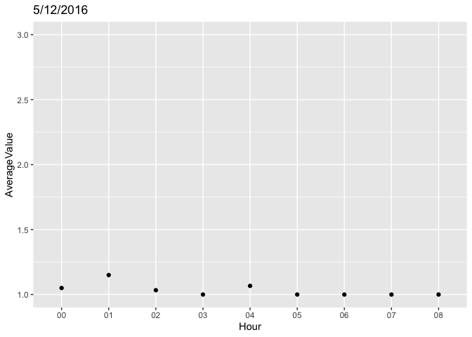<!-- -->

```r
draw_sit(specificId, specificDate)
```

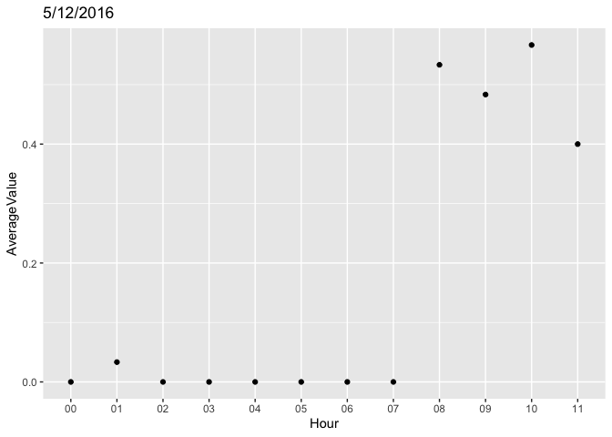<!-- -->


```r
step_sleep %>%
  select(Id, ActivityDate, TotalMinutesAsleep) %>%
  filter(TotalMinutesAsleep < 200) %>%
  arrange(Id)
```

```
##            Id ActivityDate TotalMinutesAsleep
## 1  1644430081   2016-04-29                119
## 2  1644430081   2016-04-30                124
## 3  1644430081   2016-05-08                137
## 4  1927972279   2016-04-28                166
## 5  2320127002   2016-04-23                 61
## 6  3977333714   2016-04-20                152
## 7  4020332650   2016-04-16                 77
## 8  4319703577   2016-04-21                 59
## 9  4388161847   2016-05-09                 62
## 10 4388161847   2016-04-22                 82
## 11 4388161847   2016-04-18                 99
## 12 4445114986   2016-04-17                 98
## 13 4445114986   2016-04-29                106
## 14 4558609924   2016-04-26                103
## 15 4558609924   2016-05-01                115
## 16 4558609924   2016-05-08                123
## 17 4558609924   2016-04-21                126
## 18 4558609924   2016-04-29                171
## 19 5577150313   2016-05-05                 74
## 20 7007744171   2016-05-01                 58
## 21 7007744171   2016-04-16                 79
## 22 8053475328   2016-05-07                 74
```


```r
specificId = 7007744171
specificDate = "4/16/2016"

draw_sleep(specificId, specificDate)
```

<!-- -->

```r
draw_sit(specificId, specificDate)
```

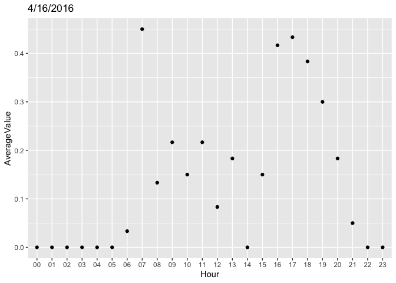<!-- -->

We have found that our previous hypothesis was not entirely accurate. The direct reason for the occurrence of short sleep duration and prolonged sedentary time is the incomplete sleep data in the dataset. In some days, the sleep data only includes partial sleep duration (such as only naps or partial nighttime sleep). Additionally, for some data points with long sleep duration but short sedentary time, we have also discovered that this is due to incomplete sitting time data being uploaded (such as data only covering half a day, rather than the normal 24-hour full day data).

Despite the missing sleep data, we have observed that during normal sleep, the values for sitting time are also quite low. This suggests that perhaps sitting time could be used to supplement the missing sleep data. However, we are also curious about the smart devices responsible for monitoring sitting time and sleep duration, and why there is a significant amount of missing sleep data.


## How could these trends apply to Bellabeat customers? How could these trends help influence Bellabeat marketing strategy? -> **Customer trend & marketing strategy**
1. Based on the average daily step and step distribution, we found that a lot of customers' daily steps were lower than the recommendation number from CDC, which means they still need more exercise. **Bellabeat can use this data in their marketing campaign to encourage customers to participate in training more actively.**

2. Based on the distribution of activity, we found that most people preferred doing light activity. It is necessary to do more user research to know why people have such perference. **The result will influence the marketing strategy of Bellabeat: either encourage people to do more high intensity exercise or develop products to assist people in doing light intensity exercise. **

3. Based on the daily and hourly step distribution during weekdays and weekends, we found that customers had different walking patterns. Specifically, we found that step counts are more concentrated and have larger medians on weekdays. On weekends, the distribution of steps is more spread out, and some people will walk more than usual. Meanwhile, weekday and weekend have different peaks. In weekdays, people prefer doing exercise during 17:00-19:00, while on weekends, people prefer walking at noon (13:00-14:00). **It suggests that customers' walking plan should be customized based on their preference and the date/time.** Bellabeat should consider such difference if it wants to recommend walking plan to customer. 
4. Based on the hourly step distribution, we found that people preferred doing exercise at noon (12:00-14:00) or evening (17:00-19:00). **Bellabeat can use the data as the default time to inform customers to do exercise.**

5. Based on the correlation between steps and intensity/calories, we found that the calories and intensity could be very high even with a few steps. **This suggests that customers can do some exercises with few steps but have high calories consumption and intensity. Bellabeat should consider this situation and be more adaptive to people's training preference (e.g., high-intensity and short-time activities, or low-intensity and long-time acitivities).**

